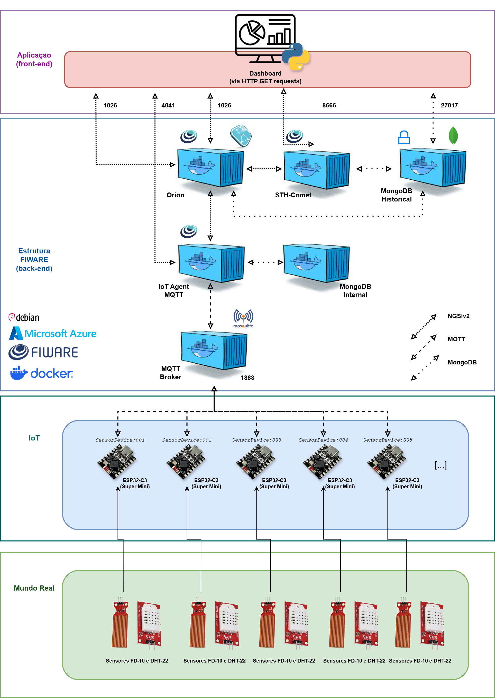
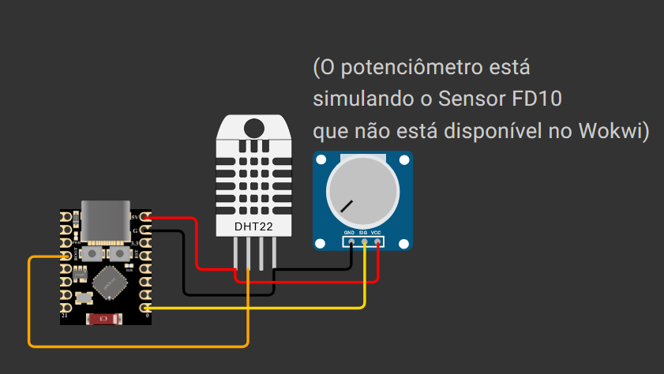

# FIAP - Global Solution 2025.1 - Edge Computing - Grupo Moskitto GS - 1ESPA

### [Link da Simulação no Wokwi](https://wokwi.com/projects/432389305702575105)

## Membros do Grupo Moskitto GS:
- [**Gabriel Kato**](https://github.com/kato8088) - RM560000
- [**Gabriel Couto**](https://github.com/rouri404) - RM559579
- [**João Vitor**](https://github.com/joaomatosq) - RM559246

## Para que serve o nosso projeto? (Descrição do Projeto):
Nosso projeto para a Global Solution 2025.1 da FIAP (Protech the Future) consiste em uma solução usando placas de desenvolvimento ultra-compactas ESP32-C3 Super Mini como ferramenta de medição de fatores ambientais de uma certa região, sendo elas, temperatura, umidade e nível da água coletada da chuva (pluviômetro). Essas medições servem para estatisticamente determinar previamente enchentes e prevenir ou até mesmo evitar que tais desastres tenham consequências maiores para a população/região.

## Componentes Utilizados:
- ESP32-C3 Super Mini
- Sensor de Temperatura e Umidade (DHT22)
- Sensor de Nível de Água (FD-10)

## Qual a estrutura do nosso projeto? (Diagrama da Arquitetura do Projeto):

## Como montar o projeto? (Esquema de Montagem):

## Como rodar o Projeto?
Faça uma cópia do nosso projeto no Wokwi (https://wokwi.com/projects/432389305702575105) e ajuste as variáveis conforme as necessidades do seu projeto (nome do dispositivo e IP do seu servidor) e não se esqueça de configurar o FIWARE de acordo no seu servidor!

Após as configurações, para a simulação do Wokwi, aperte o botão de iniciar, aguarde a compilação do projeto e pronto! Altere os valores dos sensores para ver os valores mudando e as alterações sendo enviadas via FIWARE (MQTT) para o seu servidor!

Para ESP32-C3 (hardware físico), comece conectando os componentes de maneira correta seguindo o esquema de montagem fornecido na documentação porém instalando a saída do sensor FD-10 no pino 0 do ESP32-C3 ao invés do potenciômetro da simulação (potenciômetro usado por conta do FD-10 não estar disponível no Wokwi).

Nota: o código desse projeto provavelmente é compatível com outros modelos do ESP32 e placas de desenvolvimento Arduino, porém foi pensado para o ESP32-C3 Super Mini, portanto não foi testado o funcionamento em outras placas, que podem não funcionar como esperado.